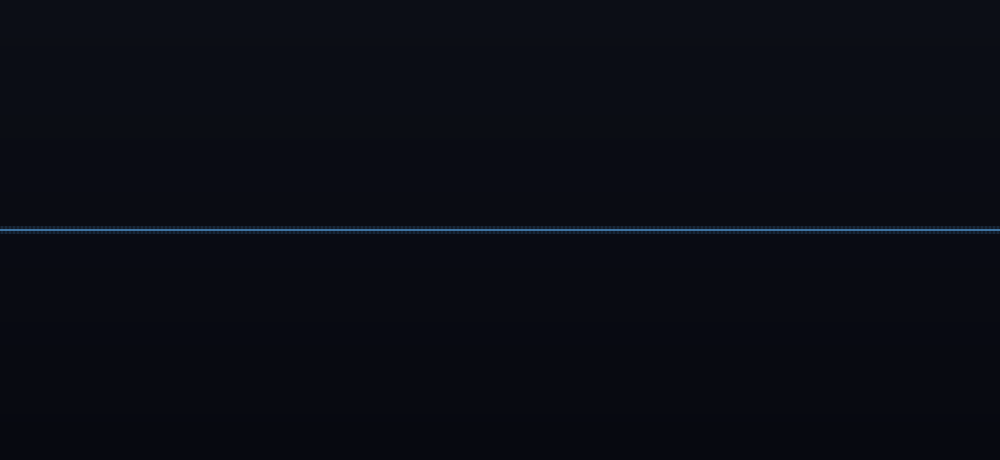

# timeline2gif

Generate animated timeline graphics from a plain-text description file.
Drop the result into a slide deck, README, or website.



*APT intrusion timeline — threat detection, lateral movement, containment.
Generated from [`samples/threat.tig`](samples/threat.tig).*

---

## Features

| | |
|---|---|
| **Themeable** | Custom background gradient, accent colour, text colour |
| **Per-event styling** | Each dot, connector line, and label can have its own colour |
| **SVG & PNG icons** | Replace dots with any SVG or PNG icon |
| **Real time positions** | Place events at arbitrary x positions to reflect actual time gaps |
| **Fast transit** | Camera sprints across large time gaps automatically |
| **Segmented timeline** | Colour the timeline line differently between any two events |
| **Transitions** | Fade, wipe, dissolve, or pixelize between events |
| **Output formats** | GIF · WebP · APNG |

---

## Quick start

```sh
# Build
mkdir build && cd build
cmake ..
make

# Run
./src/timeline2gif  my-timeline.tig  output.gif
./src/timeline2gif  my-timeline.tig  output.webp   # much smaller
./src/timeline2gif  my-timeline.tig  output.apng
```

---

## .tig file format

A `.tig` file contains global settings followed by event entries.

```
# Canvas
image.width  1000
image.height 460

# Theme
theme.background  argb(255,12,14,22)
theme.background2 argb(255,7,9,16)
theme.accent      argb(255,70,130,180)
theme.text        argb(255,210,215,225)

# Timeline position (y pixel)
timeline.position 230

# Fonts — any Pango/system font family name
description.font_size 13
time.font_size        10

# Animation speed (centiseconds)
speed.frames   4
speed.nextitem 65

# 1 unit = 1 hour; 18 px/hour
item.spacing 18
camera.scroll yes

# Between-event transitions: none | fade | wipe | dissolve | pixelize
transition.style      wipe
transition.frames     16
# dissolve / pixelize only: pixel block size (smaller = finer grain)
transition.block_size 8

# Events
"Day 1  08:00" "Phishing email — initial access"
"Day 1  16:00" "Lateral movement detected"
"Day 2  16:00" "SIEM alert — SOC engaged"
"Day 3  00:00" "Threat contained"
```

### Colors — `argb(alpha, red, green, blue)`

All color values use `argb()` with components 0–255.  
`alpha=255` is fully opaque.  **No spaces inside the parentheses.**

---

## Per-event customization

Place these settings **immediately before** an event line.
They apply to that one event only, then reset to defaults.

```
# Custom dot, text, and connector colours
event.dot_color   argb(255,220,60,60)
event.text_color  argb(255,255,140,120)
event.line_color  argb(255,180,40,40)
"Day 1  08:00" "Phishing email"

# Color the timeline segment leading INTO this event
event.timeline_color argb(255,200,60,60)
"Day 1  10:00" "C2 beacon"

# Place at an explicit world-space x position (real time gap)
# item.spacing=18 → 1 hour = 18 px, so 24 hours = 432 px gap
event.x 504
"Day 2  12:00" "Data exfiltration"

# Replace dot with an SVG or PNG icon
event.image      "icons/shield.svg"
event.image_size 28
"Day 3  00:00" "Threat contained"
```

Large `event.x` gaps (> 3 × `item.spacing`) automatically trigger
a fast camera sprint, making the time distance visible to viewers.

---

## More examples

| Sample | Description |
|--------|-------------|
| [`samples/threat.tig`](samples/threat.tig) | APT intrusion — icons, segment colours, time gaps |
| [`samples/transitions.tig`](samples/transitions.tig) | Dissolve transitions, real-month positioning |
| [`samples/custom.tig`](samples/custom.tig) | Per-event colours and SVG icons |
| [`samples/first.tig`](samples/first.tig) | Minimal example, good starting point |

Run any of them from the repository root:

```sh
./build/src/timeline2gif  samples/threat.tig  samples/threat.webp
```

Full syntax reference: [`docs/syntax.md`](docs/syntax.md)

---

## Dependencies

| Library | Purpose |
|---------|---------|
| Cairo 1.14+ | 2D rendering, anti-aliasing |
| Pango / pangocairo | Font layout and rendering |
| librsvg 2.52+ | SVG icon loading |
| libgd | GIF encoding |
| libwebp / libwebpmux | Animated WebP encoding |
| zlib | APNG compression |
| Bison + Flex | `.tig` file parser |

On macOS with Homebrew:

```sh
brew install cairo pango librsvg gd webp bison flex
```

On Ubuntu/Debian:

```sh
sudo apt install libcairo2-dev libpango1.0-dev librsvg2-dev \
                 libgd-dev libwebp-dev bison flex cmake
```
