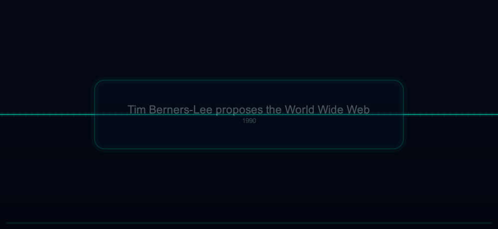
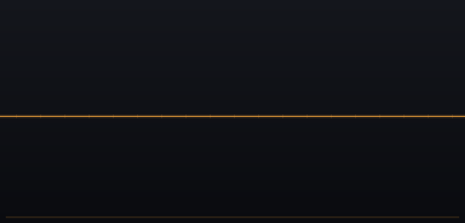
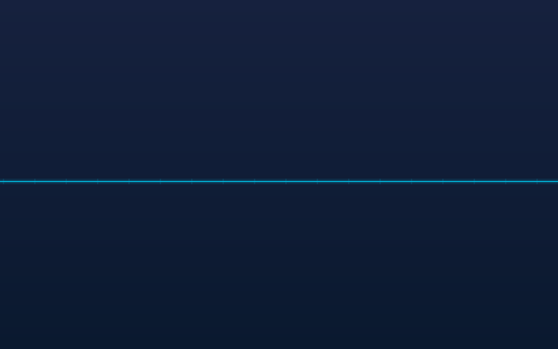
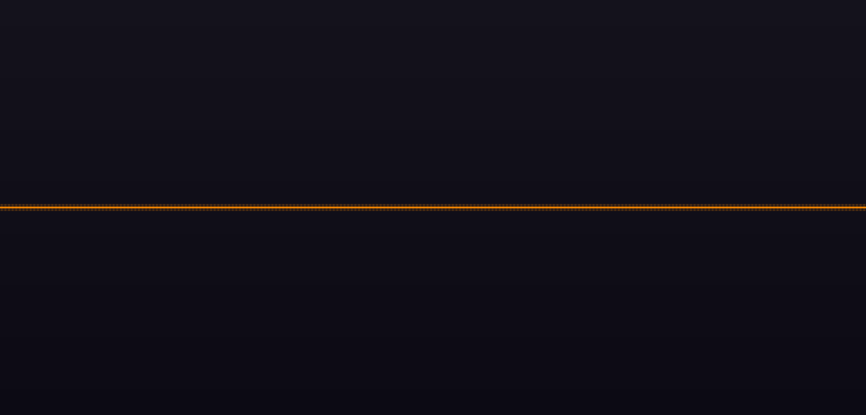
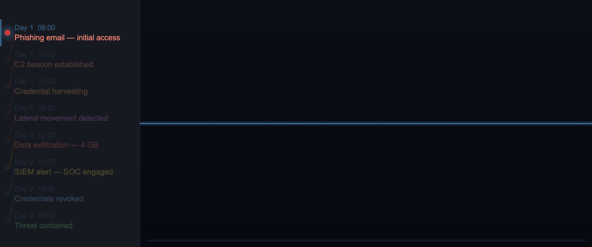
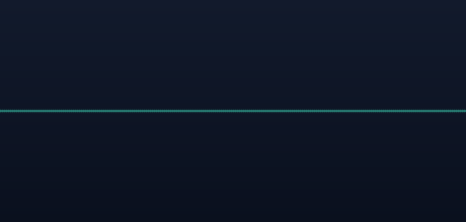

# timeline2gif

**Turn a plain-text file into a cinematic, animated timeline.**
Write a few lines, get a polished GIF / WebP / APNG you can drop straight into a
slide deck, README, or website — no design tools, no timeline editor.



<sup>*Each event spotlights as a card that fades in, pauses, then exits with a
`funnel` · `zoom` · `float` · `fan` effect. Generated from
[`samples/callout.tig`](samples/callout.tig).*</sup>

---

## New: heavy-drop wobble



Turn on `timeline.drop` and each event lands like a heavy object: the line
**dips, bounces, and settles**. It's configurable **per event** — let the major
milestones land with a thud while minor steps glide in flat:

```
event.drop        yes      # this event wobbles…
event.drop_amount 20       # …with a deeper dip
"v1.0" "Stable release lands"

event.drop no              # …this one glides in flat
"v1.4" "Security audit passed"
```

<sup>*Generated from [`samples/drop.tig`](samples/drop.tig) — only the major
releases (`v1.0`, `v2.0`) opt into the drop.*</sup>

---

## See it in action

<table>
<tr>
<td width="50%" valign="top">



**Minimal start** — a handful of lines produces a clean, themeable timeline.
A good template to copy and build from.
<br><sub>[`samples/first.tig`](samples/first.tig)</sub>

</td>
<td width="50%" valign="top">



**Transitions** — blend between events with `fade`, `wipe`, `dissolve` or
`pixelize`, with real-month positioning along the line.
<br><sub>[`samples/transitions.tig`](samples/transitions.tig)</sub>

</td>
</tr>
<tr>
<td width="50%" valign="top">



**Split-screen tracker** — a side panel lists every event, dimming what's ahead
and highlighting the current step, while the timeline animates beside it.
<br><sub>[`samples/split.tig`](samples/split.tig)</sub>

</td>
<td width="50%" valign="top">


**Image callouts** — drop SVG / PNG / GIF / JPEG art into callout cards and
connector labels, with or without text.
<br><sub>[`samples/image_callout.tig`](samples/image_callout.tig)</sub>

</td>
</tr>
<tr>
<td width="50%" valign="top">


**Smart pacing + progress bar** — hold longer on the steps that matter; a
progress bar shows how far through the story you are.
<br><sub>[`samples/pause.tig`](samples/pause.tig)</sub>

</td>
<td width="50%" valign="top">



**Per-event styling** — give every dot, label, connector and timeline segment
its own colour, or swap the dot for an icon.
<br><sub>[`samples/custom.tig`](samples/custom.tig)</sub>

</td>
</tr>
</table>

---

## Features

| | |
|---|---|
| **Heavy-drop wobble** | Events land like a dropped weight — the line dips, bounces, settles; per-event opt-in |
| **Animated callouts** | Spotlight each event as a card that fades in, pauses, and exits with `funnel` · `zoom` · `float` · `fan` |
| **Transitions** | `fade` · `wipe` · `dissolve` · `pixelize` between events |
| **Split-screen panel** | Side list of all events — past, present, and dimmed future |
| **Progress bar** | Optional bar tracking position through the timeline |
| **Themeable** | Custom background gradient, accent colour, text colour |
| **Per-event styling** | Each dot, connector line, label, and segment can have its own colour |
| **SVG · PNG · GIF · JPEG** | Replace dots, fill callouts, or label connectors with any image |
| **Real-time positions** | Auto-position from dates, or place events at explicit x to reflect real gaps |
| **Fast transit** | Camera sprints across large time gaps automatically |
| **Smart pacing** | Per-event pauses and a loop pause for comfortable reading |
| **Output formats** | GIF · WebP · APNG |

---

## Quick start

```sh
# Build
mkdir build && cd build
cmake ..
make

# Run
./src/timeline2gif  my-timeline.tig  output.gif
./src/timeline2gif  my-timeline.tig  output.webp   # much smaller
./src/timeline2gif  my-timeline.tig  output.apng
```

Or render any of the bundled samples from the repository root:

```sh
./build/src/timeline2gif  samples/callout.tig  out.webp
```

---

## .tig file format

A `.tig` file contains global settings followed by event entries.

```
# Canvas
image.width  1000
image.height 460

# Theme
theme.background  argb(255,12,14,22)
theme.background2 argb(255,7,9,16)
theme.accent      argb(255,70,130,180)
theme.text        argb(255,210,215,225)

# Timeline position (y pixel)
timeline.position 230

# Fonts — any Pango/system font family name
description.font_size 13
time.font_size        10

# Animation speed (centiseconds)
speed.frames     4
speed.nextitem   65
speed.loop_pause 300   # hold on the final frame before looping

# 1 unit = 1 hour; 18 px/hour
item.spacing 18
camera.scroll yes

# Between-event transitions: none | fade | wipe | dissolve | pixelize
transition.style      wipe
transition.frames     16
transition.block_size 8   # dissolve / pixelize grain (smaller = finer)

# Optional progress bar
progress.show  yes
progress.color argb(255,70,130,180)

# Events
"Day 1  08:00" "Phishing email — initial access"
"Day 1  16:00" "Lateral movement detected"
"Day 2  16:00" "SIEM alert — SOC engaged"
"Day 3  00:00" "Threat contained"
```

### Colors — `argb(alpha, red, green, blue)`

All color values use `argb()` with components 0–255.
`alpha=255` is fully opaque.  **No spaces inside the parentheses.**

---

## Per-event customization

Place these settings **immediately before** an event line.
They apply to that one event only, then reset to defaults.

```
# Custom dot, text, and connector colours
event.dot_color   argb(255,220,60,60)
event.text_color  argb(255,255,140,120)
event.line_color  argb(255,180,40,40)
"Day 1  08:00" "Phishing email"

# Color the timeline segment leading INTO this event
event.timeline_color argb(255,200,60,60)
"Day 1  10:00" "C2 beacon"

# Place at an explicit world-space x position (real time gap)
# item.spacing=18 → 1 hour = 18 px, so 24 hours = 432 px gap
event.x 504
"Day 2  12:00" "Data exfiltration"

# Replace dot with an SVG or PNG icon
event.image      "icons/shield.svg"
event.image_size 28
"Day 3  00:00" "Threat contained"

# Hold longer on an important step (centiseconds)
event.pause 400
"Day 3  00:00" "Threat contained"
```

Large `event.x` gaps (> 3 × `item.spacing`) automatically trigger
a fast camera sprint, making the time distance visible to viewers.

---

## Callout spotlights

Turn each event into a centred card that fades in, pauses for reading, then
exits with an effect — great for storytelling decks.

```
callout.shape   rounded         # rectangle | rounded | cloud
callout.pause   150             # centiseconds to hold the card
callout.effect  funnel          # none | funnel | zoom | float | fan
callout.color   argb(255,5,18,38)
callout.border  argb(255,0,210,190)

# Per-event exit effect and optional image inside the card
event.callout_effect zoom
event.callout_image      "icons/rocket.svg"
event.callout_image_size 60
"2022" "Generative AI goes mainstream"
```

| Effect | Motion on exit |
|--------|----------------|
| `none`   | Plain fade-out |
| `funnel` | Card contracts toward the event dot |
| `zoom`   | Card scales to zero at its centre |
| `float`  | Card drifts upward while fading |
| `fan`    | Card spins (2.5 turns) while contracting to the dot |

---

## Split-screen & progress bar

```
# Side panel listing all events
split.show       yes
split.width      260
split.background  argb(255,10,12,20)

# Progress bar across the bottom
progress.show   yes
progress.color  argb(255,70,130,180)
```

---

## More examples

| Sample | Shows off |
|--------|-----------|
| [`samples/threat.tig`](samples/threat.tig) | APT intrusion — icons, segment colours, time gaps |
| [`samples/drop.tig`](samples/drop.tig) | Per-event heavy-drop wobble |
| [`samples/callout.tig`](samples/callout.tig) | Callout spotlights with all four exit effects |
| [`samples/image_callout.tig`](samples/image_callout.tig) | Images inside callouts and connector labels |
| [`samples/split.tig`](samples/split.tig) | Split-screen event panel |
| [`samples/pause.tig`](samples/pause.tig) | Per-event pacing and the progress bar |
| [`samples/transitions.tig`](samples/transitions.tig) | Dissolve transitions, real-month positioning |
| [`samples/custom.tig`](samples/custom.tig) | Per-event colours and SVG icons |
| [`samples/first.tig`](samples/first.tig) | Minimal example, good starting point |

Full syntax reference: [`docs/syntax.md`](docs/syntax.md)

---

## Dependencies

| Library | Purpose |
|---------|---------|
| Cairo 1.14+ | 2D rendering, anti-aliasing |
| Pango / pangocairo | Font layout and rendering |
| librsvg 2.52+ | SVG icon loading |
| libgd | GIF encoding, raster image loading |
| libwebp / libwebpmux | Animated WebP encoding |
| zlib | APNG compression |
| Bison + Flex | `.tig` file parser |

On macOS with Homebrew:

```sh
brew install cairo pango librsvg gd webp bison flex
```

On Ubuntu/Debian:

```sh
sudo apt install libcairo2-dev libpango1.0-dev librsvg2-dev \
                 libgd-dev libwebp-dev bison flex cmake
```
</content>
</invoke>
